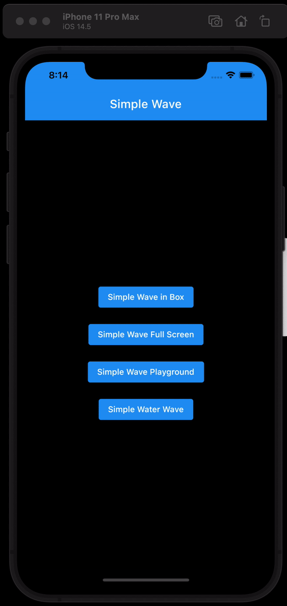

# simple_wave

[](https://pub.dev/packages/simple_wave)

<a href="https://www.producthunt.com/posts/simple_wave?utm_source=badge-featured&utm_medium=badge&utm_souce=badge-simple_wave" target="_blank"></a>

A Flutter plugin for wave animation.




## Usage

To use this plugin, add [`simple_wave`](https://pub.dev/packages/simple_wave) as a [dependency in your pubspec.yaml file](https://flutter.dev/docs/development/packages-and-plugins/using-packages/).

## Example

Import the library.

``` dart
import 'package:simple_wave/simple_wave.dart';
```

Then invoke the `SimpleWaveWidget` method to create simple wave.

``` dart
SimpleWaveWidget(
    waveHeight: MediaQuery.sizeOf(context).height,
    waveWidth: MediaQuery.sizeOf(context).width,
)
```

The `SimpleWaveWidget` method takes required `waveWidth`, `waveHeight` and optional `waveColor`, `amplitude`, `waveMilliseconds` arguments.

``` dart
SimpleWaveWidget(
    waveWidth: 300, // this changes width of wave
    waveHeight: 150, // this changes height of wave
    waveColor: Colors.blue, // this changes color of wave
    amplitude: 50, // this changes height of wave
    waveMilliseconds: 5000, //this changes speed of wave
    numberOfWave: 10, //this changes number of waves
)
```

Checkout [this package demo](https://flutter-web-wave.netlify.app/#/) in [Flutter Web](https://flutter.dev/docs/get-started/web).

View [Medium story](https://ankit-solanki.medium.com/simple-wave-642028811e36)